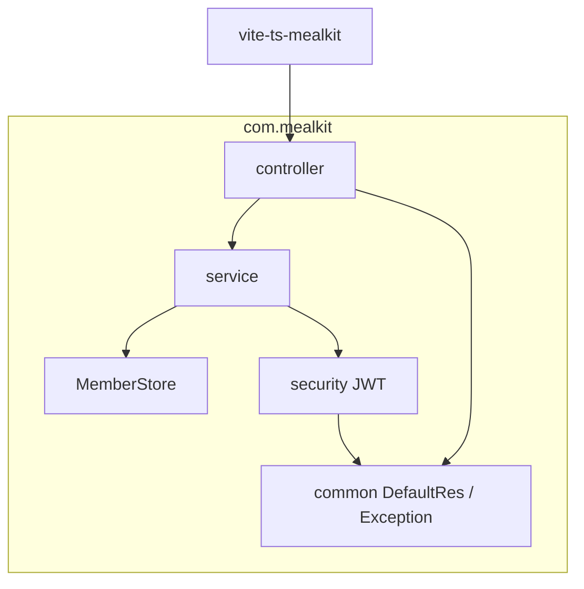
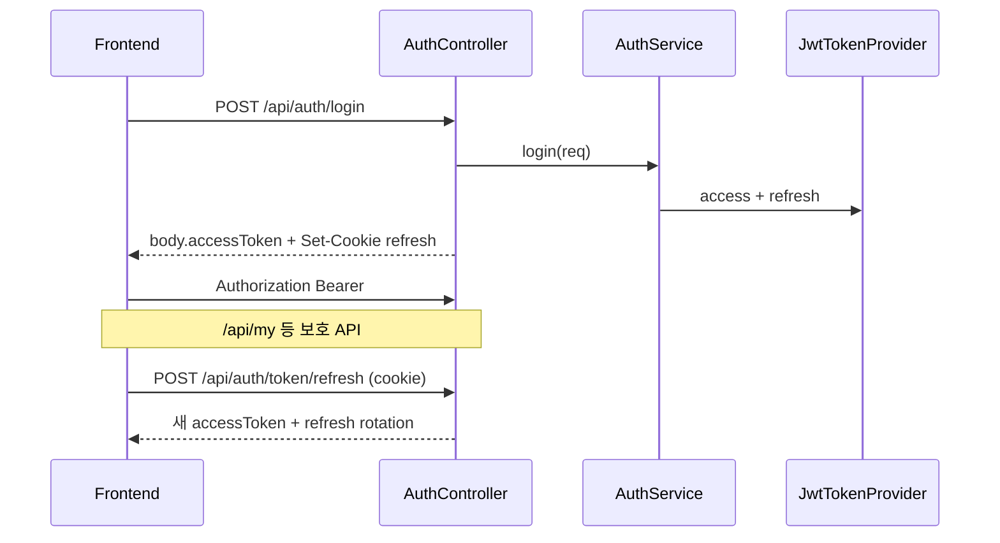

# spring-boot-mealkit

ctl_backend 패턴을 이식한 **Spring Boot 3 + Maven 스타터**.  
`vite-ts-mealkit` 과 같은 응답 계약·인증 흐름으로 프론트와 바로 붙일 수 있다.


| 문서 | 내용 |
| --- | --- |
| [`docs/ARCHITECTURE.md`](docs/ARCHITECTURE.md) | 패키지·보안·확장 포인트 |
| [`docs/TESTING.md`](docs/TESTING.md) | MockMvc · 데모 계정 · CI |

---

## 목차

1. [설계 방향](#설계-방향)
2. [기술 스택](#기술-스택)
3. [시작하기](#시작하기)
4. [런타임·패키지](#런타임패키지)
5. [인증](#인증)
6. [API](#api)
7. [설정](#설정)
8. [테스트](#테스트)
9. [프론트 연동](#프론트-연동)
10. [확장 체크리스트](#확장-체크리스트)

---

## 설계 방향

### 푸는 문제

- 프로젝트마다 Security·JWT·공통 응답을 처음부터 다시 짜는 일
- 프론트(`code === '0000'`)와 백엔드 응답 형식이 어긋나는 일
- access Bearer + refresh httpOnly 쿠키 패턴이 문서화되지 않은 일
- DB 없이도 로그인·인가를 로컬에서 검증할 수단이 없는 일

### 원칙

1. **Controller는 얇게** — 검증·응답 래핑. 비즈니스는 Service.
2. **실패는 `CommonExceptions(ExceptionEnum)`** — `GlobalExceptionHandler`가 `DefaultRes`로 통일.
3. **성공은 `code=0000`** — HTTP 200만으로 성공을 판단하지 않는다 (프론트와 동일).
4. **저장소는 포트로 분리** — `MemberStore`. 기본은 MyBatis(RDBMS), 옵션으로 인메모리 프로필.
5. **`/api/**` 는 기본 인증** — login / refresh / logout / health / swagger만 공개.
6. **vite-ts-mealkit 과 경로·쿠키 계약을 맞춤** — `mealkit_refreshToken`, `/api/auth/*`.

ctl 대비 의도적 생략: 메일·비밀번호 재설정·메뉴 권한·war SPA. MyBatis+H2/MariaDB는 스타터에 포함.

---

## 기술 스택

| 영역 | 선택 |
| --- | --- |
| Runtime | Java 17+, Spring Boot 3.4.2 |
| Build | Maven (`jar`) |
| Security | Spring Security (STATELESS) + JJWT |
| Persistence | MyBatis + H2(`local`) / MariaDB(`mariadb`) |
| API docs | springdoc-openapi (local/dev/default) |
| Test | JUnit 5, MockMvc, spring-security-test |
| 회원 | `MyBatisMemberStore` (기본) · `InMemoryMemberStore`(`inmemory`) |

---

## 시작하기

```bash
# JDK 17+
mvn spring-boot:run
```

Maven Wrapper:

```bash
./mvnw spring-boot:run   # Windows: mvnw.cmd spring-boot:run
```

- API: http://localhost:8080
- Swagger: http://localhost:8080/swagger-ui.html
- Health: http://localhost:8080/api/health

데모 계정: `admin` / `password`, `user` / `password`

```bash
mvn test
```

---

## 런타임·패키지



```
src/main/java/com/mealkit/
  MealkitApplication.java
  common/     dto · exception · config(Security, Swagger, CORS, MyBatis)
  security/   Jwt* · MemberPrincipal
  auth/       controller · service · store · mapper · model · dto · support
  health/
  member/     GET /api/my
src/main/resources/
  db/schema.sql
  mapper/auth/Member.xml
  application.yml · application-local.yml · application-mariadb.yml · application-inmemory.yml
src/test/java/com/mealkit/
  auth/AuthFlowTest
  health/HealthControllerTest
```

### 회원 저장소 프로필

| 프로필 | 저장소 | 비고 |
| --- | --- | --- |
| `local` (기본) | H2 mem + MyBatis | 외부 DB 없이 RDBMS 경로 검증 |
| `mariadb` | MariaDB + MyBatis | `MEALKIT_DB_*` 환경 변수 |
| `inmemory` | `InMemoryMemberStore` | DataSource/MyBatis 제외 |

```bash
mvn spring-boot:run                                          # local = H2
mvn spring-boot:run -Dspring-boot.run.profiles=mariadb       # MariaDB
mvn spring-boot:run -Dspring-boot.run.profiles=inmemory      # 인메모리
```

전환 주석은 `MemberStore`, `MyBatisMemberStore`, `InMemoryMemberStore`, `MealkitApplication` 에 있다.
---

## 인증




| 토큰 | 전달 |
| --- | --- |
| Access | JSON `result.accessToken` → 프론트 localStorage |
| Refresh | httpOnly 쿠키 `mealkit_refreshToken` |

화이트리스트: `/api/auth/login`, `/token/refresh`, `/logout`, `/api/health`, swagger.

---

## API

| Method | Path | Auth | 설명 |
| --- | --- | --- | --- |
| GET | `/api/health` | 공개 | 헬스체크 |
| POST | `/api/auth/login` | 공개 | 로그인 |
| POST | `/api/auth/token/refresh` | 쿠키 | 재발급 |
| POST | `/api/auth/logout` | 공개 | 쿠키 삭제 |
| GET | `/api/my` | Bearer | 내 정보 |

응답 예:

```json
{
  "code": "0000",
  "message": "Success",
  "result": {
    "accessToken": "eyJ...",
    "loginId": "admin",
    "role": "2",
    "id": 1,
    "name": "관리자"
  }
}
```

---

## 설정

`src/main/resources/application.yml` (기본 `local` 프로필).

| 키 | 의미 |
| --- | --- |
| `server.port` | 기본 8080 |
| `spring.datasource.*` | H2(`local`) / MariaDB(`mariadb`) |
| `mybatis.mapper-locations` | `classpath:/mapper/**/*.xml` |
| `jwt.secret` | access HMAC (32바이트+) |
| `jwt.expiration` | access 만료 ms |
| `jwt.refresh-secret` | refresh HMAC |
| `jwt.refresh-expiration` | refresh 만료 ms (기본 7일) |
| `mealkit.cors.allowed-origins` | CORS (5173, 5177) |

H2 콘솔(local): http://localhost:8080/h2-console (`jdbc:h2:mem:mealkit`)

---

## 테스트

상세: [`docs/TESTING.md`](docs/TESTING.md)

```bash
mvn test
```

커버: health 공개, 로그인 성공/실패, Bearer로 `/api/my`, 미인증 401.

---

## 프론트 연동

`vite-ts-mealkit` `.env`:

```env
VITE_SERVER_URL=http://localhost:8080
```

프론트는 `withCredentials: true` 로 refresh 쿠키를 보낸다. CORS `allowCredentials` + origin 화이트리스트가 이미 맞춰져 있다.

---

## 확장 체크리스트

**도메인 API**

1. `com.mealkit.{domain}` 패키지 (controller / service / dto)
2. 실패 → `CommonExceptions`
3. 성공 → `DefaultRes.build`
4. MockMvc 테스트
5. Swagger group (선택)

**DB (이미 포함 — 확장 시)**

1. `db/schema.sql` · `mapper/**/*.xml` 도메인 테이블/쿼리 추가
2. 필요 시 Flyway/Liquibase로 `spring.sql.init` 대체
3. `MemberDataInitializer` 는 운영에서 끄거나 시드 정책 분리
4. MariaDB: `spring.profiles.active=mariadb` + `MEALKIT_DB_*`

**운영**

1. `jwt.*` 비밀키 교체
2. CORS production origin
3. `spring.profiles.active=prod` 에서 swagger off (`@Profile` 조정)
