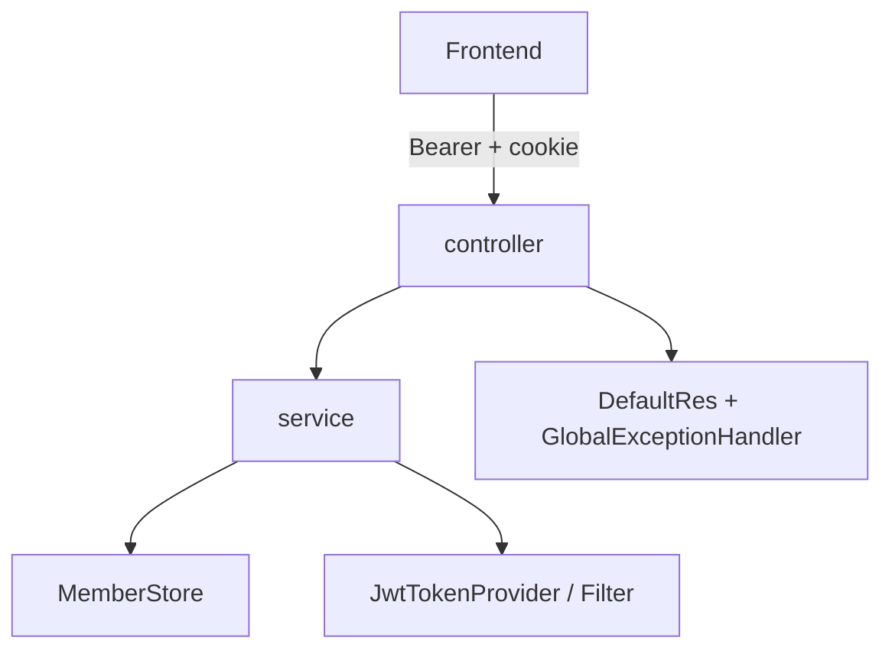

# 아키텍처

패키지·보안·회원 저장소·확장 절차를 정리한다.

## 한눈에




## 패키지

```
com.mealkit
  MealkitApplication
  common/          DefaultRes, exception, SecurityConfig, Swagger, CORS
  security/        JWT filter · provider · principal · entry point
  auth/            login · refresh · logout · store · mapper · model
  health/          GET /api/health
  member/          GET /api/my
```

도메인이 늘면 `com.mealkit.{domain}.{controller|service|mapper|dto}` 로 확장한다.

## 응답 계약

프론트와 동일:

```json
{ "code": "0000", "message": "Success", "result": { } }
```

- 성공: HTTP 200 + `code=0000` (`DefaultRes.build`)
- 업무/인증 실패: `CommonExceptions` → `GlobalExceptionHandler` (`E100001` 등)
- 미인증 API: 401 + JSON (`JwtAuthenticationEntryPoint`)

## 보안


| 항목 | 내용 |
| --- | --- |
| 세션 | STATELESS |
| Access | `Authorization: Bearer` |
| Refresh | httpOnly 쿠키 `mealkit_refreshToken` |
| 화이트리스트 | `/api/auth/**`(login/refresh/logout), `/api/health`, swagger |
| 그 외 `/api/**` | authenticated |

JWT claim: `sub`(loginId), `role`, `identifyKey`, `name`, `type`(access|refresh)

## 회원 저장소 (RDBMS 기본)

```
AuthService → MemberStore
                ├─ MyBatisMemberStore (!inmemory) → MemberMapper → member 테이블
                └─ InMemoryMemberStore (inmemory)
```

| 프로필 | 구현 | 설정 |
| --- | --- | --- |
| `local` | H2 + `MyBatisMemberStore` | `application-local.yml`, `db/schema.sql` |
| `mariadb` | MariaDB + 동일 Store | `application-mariadb.yml` |
| `inmemory` | `InMemoryMemberStore` | `application-inmemory.yml` (JDBC/MyBatis exclude) |

`AuthService` 는 포트만 의존한다. 구현 교체 시 서비스 수정은 필요 없다.  
`member` / `member_info` 분리 조인이 필요하면 `Member.xml` · `MemberRow` 만 확장하면 된다.

## 스타터 범위

| 포함 | 미포함 |
| --- | --- |
| MyBatis + H2(기본) / MariaDB 프로필 | 비밀번호 재설정·메일 |
| jar API 서버 | WAR + 정적 SPA |
| role claim | 메뉴 권한 체계 |
| auth / health / my | 대량 도메인 모듈 |

## 새 API 추가 절차

1. `dto/req`, `dto/res` 작성 (`@Valid`)
2. `service` — 실패는 `throw new CommonExceptions(ExceptionEnum.…)`
3. `controller` — `DefaultRes.build(result)`
4. 보호 API면 Security whitelist에 넣지 않음
5. 필요 시 `SwaggerConfig`에 패키지 추가
6. `MockMvc` 테스트 추가

## 프론트 연동

| 백엔드 | 프론트 (`vite-ts-mealkit`) |
| --- | --- |
| `POST /api/auth/login` | `usePostAuthLogin` |
| `POST /api/auth/token/refresh` | axios 401 interceptor |
| `POST /api/auth/logout` | `usePostAuthLogout` |
| `GET /api/health` | `useGetHealth` |
| `GET /api/my` | Bearer 보호 화면 |
